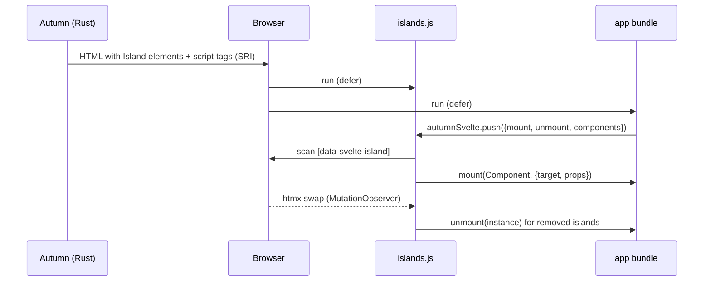

# ADR 0001: Svelte islands through a plugin asset bundle

- Status: accepted
- Date: 2026-10-05

## Context

Autumn renders HTML on the server with Maud and htmx. Some page parts need
rich client state. Svelte compiles components to JavaScript at build time.
No Rust tool can compile or server-render Svelte. `autumn-web` 0.8.0 gives
`PluginAssets`. Autumn compiles the files into the crate. It serves them
with fingerprinted URLs, `immutable` cache and SRI hashes.

## Decision

1. The plugin ships one file, `islands.js` (the loader), as the
   `SVELTE_ASSETS` bundle (namespace `svelte`).
2. The app compiles its components with Vite and Svelte 5. The entry file
   pushes `{ mount, unmount, components }` on `window.autumnSvelte`.
3. The app embeds the build output as its own `PluginAssets` bundle and
   gives it to `SveltePlugin::bundle`.
4. Rust renders each island with `Island`:

   ```html
   <div data-svelte-island="Counter" data-svelte-props='{"start":3}'
        data-svelte-mount="visible">fallback</div>
   ```

5. The loader mounts each island on the client (no hydration). It keeps the
   fallback in a `<template data-svelte-fallback>` child.
6. One `MutationObserver` mounts added islands and unmounts removed islands.
   It also watches island attributes and the fallback template. Thus an
   in-place morph mounts the island again.
7. Islands in a `data-svelte-ignore` element never mount. Islands stop at a
   nesting depth of 16.



## Consequences

- Good: no inline script, so the default CSP works.
- Good: the app selects the Svelte version. Two bundles can use two
  versions.
- Good: no Node at run time. You deploy one binary.
- Bad: the server does not render the component. The fallback content is
  the first paint.
- Bad: user HTML can make islands. Apps must use `data-svelte-ignore` and a
  sanitizer that removes `data-svelte-*`.
- Bad: the app needs Node to build its components.
